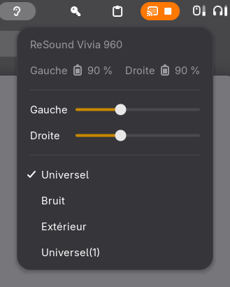

# Hearing Aid Presets

Use LE Audio hearing aids on Linux, and switch their programs from the GNOME top bar.



Tested with a pair of **ReSound Vivia 960** on Fedora 44 (kernel 7.1, BlueZ 5.87, PipeWire 1.6.8, WirePlumber 0.5.14, GNOME 50, Intel AX211). Any hearing aid that implements the Bluetooth LE Audio *Hearing Access Service* (HAS) should work with the extension; the setup notes apply to any LE Audio device.

## Compatible devices

Tested here: **ReSound Vivia 960**, binaural pair (four programs, preset synchronisation, microphone control). The same GN platform is sold under several names, so these should behave identically:

- ReSound Vivia, ReSound Nexia, ReSound Savi
- Jabra Enhance Pro 20, Jabra Enhance Select 500
- Beltone Serene, Beltone Envision

Any hearing aid advertised as **Bluetooth LE Audio** or **Auracast** capable implements the same standard services (BAP for audio, HAS for programs, VCS/MICS for volume and microphone), so the setup and the extension should apply. Manufacturers listing LE Audio support at the time of writing, none of them tested by us:

- Oticon Intent
- Phonak Audéo Infinio and Sphere Infinio, Unitron Vivante
- Starkey Genesis AI, Edge AI
- Signia Integrated Xperience (IX), Rexton Reach
- Widex Allure
- Cochlear Nucleus 8 sound processor

The full lists, with what was checked and how to report yours, live in [docs/DEVICES.md](docs/DEVICES.md) (hearing aids) and [docs/CONTROLLERS.md](docs/CONTROLLERS.md) (Bluetooth adapters that do or do not support LE Audio). If you try one, open an issue with `bluetoothctl info <MAC>` and the program list you get: that is the only way these lists get better. Aids that only speak ASHA (older Android streaming) are not covered, see [Alternatives](#alternatives).

Keywords, for the search engines: Bluetooth LE Audio hearing aids on Linux, Auracast, HAP, HAS presets, LC3, BlueZ, PipeWire, WirePlumber, Fedora, GNOME Shell extension.

What you get:

- Stereo LC3 streaming from PipeWire to both aids, through the standard BlueZ + PipeWire stack. No third-party daemon.
- A GNOME Shell extension: an ear icon appears while the aids are connected, with a menu showing the model, the battery level of each ear, a volume slider per ear, and the programs ("Universal", "Noise", "Outdoor"...). One click switches both ears. The menu follows changes made on the aids or from the phone.
- A `connect-hearing-aids` script and a user service that connect the aids at login, check that the LE Audio stream really comes up, and work around two BlueZ quirks that otherwise leave you without sound after a session restart or a reboot.

## Requirements

- A Bluetooth controller that supports LE Audio. Check with `sudo btmgmt info`: the `supported settings` line must contain `cis-central`. Intel AX2xx cards do; many cheap "Bluetooth 5.3" USB dongles (Realtek, Actions) do not, whatever the box says. See [docs/CONTROLLERS.md](docs/CONTROLLERS.md).
- BlueZ 5.77 or later, PipeWire 1.6 or later, a kernel with ISO socket support (6.x is fine).
- GNOME Shell 50 for the extension (the `shell-version` field in `extension/metadata.json` is easy to widen if you test on 46 to 49).
- Hearing aids that advertise the LE Audio services. `bluetoothctl info <MAC>` should list `Audio Stream Control`, `Published Audio Capabilities`, `Common Audio` and `Hearing Aid`.

## Installation

### 1. bluetoothd

Edit `/etc/bluetooth/main.conf` and set, in `[General]`:

```ini
Experimental = true
KernelExperimental = 6fbaf188-05e0-496a-9885-d6ddfdb4e03e
```

The first line turns on the LE Audio profiles. The second enables the kernel ISO socket; without it bluetoothd logs `BAP requires ISO Socket which is not enabled` and only the ASHA profile shows up. See `bluetooth/main.conf.snippet`.

Then keep bluetoothd's built-in `vcp` plugin out of the way. It claims the Volume Control Service characteristics (the extension would get `Operation Not Authorized`) and, worse for hearing aids, it propagates any volume change to the whole coordinated set, so left and right can never differ:

```sh
sudo mkdir -p /etc/systemd/system/bluetooth.service.d
sudo cp bluetooth/noplugin-vcp.conf /etc/systemd/system/bluetooth.service.d/
sudo systemctl daemon-reload
sudo systemctl restart bluetooth
```

The price: the GNOME volume slider no longer drives the aids' own volume through BlueZ and becomes a software gain on the stream, which is what you want anyway once the per-ear sliders exist. (`DisablePlugins` in `main.conf` is not a valid key in BlueZ 5.87, hence the systemd override.)

### 2. User side

```sh
./install.sh
```

This copies the extension to `~/.local/share/gnome-shell/extensions/`, the script to `~/.local/bin/`, enables the `hearing-aids-connect` user service, and creates `~/.config/hearing-aids/devices.conf` if missing. Edit that file with the MAC addresses of your aids (`bluetoothctl devices`):

```sh
LEFT=CC:89:6C:E0:0D:0E
RIGHT=CC:89:6C:E0:57:E7
LEFT_ALIAS="Vivia"
RIGHT_ALIAS="Vivia R"
```

The aliases are optional. PipeWire attaches the single stereo sink to the left aid, so the left alias is what you see in the GNOME sound menu; a name without a side suffix reads better there.

### 3. Pair and log in again

Pair both aids once with the GNOME Bluetooth panel or `bluetoothctl` (put them in pairing mode). Then log out and back in: GNOME only loads new extensions at login, and the user service connects the aids about 10 seconds after WirePlumber starts.

## Using it

Pick "Bluetooth – Vivia" (or your alias) as the output in the GNOME sound menu. PipeWire shows one stereo sink; the right aid is grouped into it through the LE Audio coordinated set.

The ear icon in the top bar opens the menu: battery level of each ear, one volume slider per ear, then the program list where the checked entry is the active program. The volume sliders drive the aids' own volume (what the buttons on the aids and the phone app change), independently for each ear; they follow changes made elsewhere. The header shows the manufacturer and model read from the Device Information Service ("ReSound Vivia 960"), or the device alias when the aid does not provide them. Menu strings are in English with a French translation; add a `po/<lang>.po` for another language and run `msgfmt` as in `install.sh`.

Battery levels come straight from each aid's Battery Level characteristic; bluetoothd itself does not publish `org.bluez.Battery1` for these aids (it logs `More than one BATT service exists for this device` and gives up), so the GNOME Bluetooth panel shows nothing.

Run `connect-hearing-aids` by hand whenever the aids are connected but silent, typically after PipeWire or bluetoothd restarted.

Hearing aids accept a single central at a time. While they are connected to your phone, the computer cannot connect. Turn off the phone's Bluetooth, or disconnect the aids from it, before connecting here.

## How it works

BlueZ exports every GATT characteristic of a connected device on D-Bus. The extension watches `org.bluez` through `ObjectManager`, finds the Hearing Access Service (`0x1854`) and its three characteristics, and talks HAP directly:

| Characteristic | UUID | Use |
|---|---|---|
| Hearing Aid Features | 0x2BDA | binaural or not, preset synchronisation support |
| Hearing Aid Preset Control Point | 0x2BDB | `0x01` Read Presets, `0x05` Set Active Preset, `0x08` Set Active Preset (synchronised) |
| Active Preset Index | 0x2BDC | current program, notified on change |

The preset list arrives as one indication per preset (opcode `0x02`). To switch, the extension writes `0x08 <index>` when the aids advertise preset synchronisation (the Vivia refuse the plain `0x05` with ATT error `0x80`), and falls back to `0x05` otherwise. Battery levels are the Battery Level characteristic (`0x2A19`) of each aid, and the sliders write Set Absolute Volume (`0x04`, change counter, volume 0..255) to the Volume Control Point (`0x2B7E`) of the Volume Control Service (`0x1844`), following Volume State (`0x2B7D`) notifications. Left and right come from the BAP endpoint `Locations` bitmask. The header comes from the Device Information Service (`0x180A`): Manufacturer Name String (`0x2A29`) and Model Number String (`0x2A24`), with a small table turning internal codes such as `VI960S-DRWC` into retail names.

No daemon, no polling: everything is driven by D-Bus signals.

For development, `gnome-shell --devkit --wayland` runs a second shell in a window against the real BlueZ; with `HEARING_AID_PRESETS_SCREENSHOT=/path/menu.png` in its environment the extension opens its menu and saves the screenshot used above.

## Troubleshooting

**No sound, or a weak sound on one side, after logging in or restarting PipeWire.** `pactl list cards` shows the aids' cards on profile `off` or `asha-sink`, and the WirePlumber log says `ASHA failed to flush ... written:-11`. BlueZ does not renegotiate BAP for aids that were already connected when PipeWire registered its endpoints. Run `connect-hearing-aids`: it disconnects, waits for the link to really drop (the aids reconnect by themselves within seconds, which is exactly what defeats a naive reconnect), reconnects, and checks that both cards are on `bap-sink`.

**Connected, BAP profile active, still no sound.** The bluetoothd journal shows `iso_connect_cb() connect to ...: Device or resource busy (16)` or `Connection timed out (110)`. Seen after a reboot when PipeWire first created two sinks for the pair instead of one coordinated set: each half allocated an ISO group in the controller, and the stale one blocks every later stream, surviving reconnects and even a bluetoothd restart. Only powering the adapter off and on clears it. `connect-hearing-aids` probes the stream with one second of silence, reads the journal, and does the power cycle by itself when needed. By hand: `bluetoothctl power off`, `bluetoothctl power on`, then reconnect the aids.

**One aid shows no GATT objects on D-Bus** (`busctl tree org.bluez` lists nothing under its `dev_...` path, the extension or battery meters only see the other aid). Seen with BlueZ 5.87 after reconnecting one aid alone: bluetoothd logs `No matching connection for device` and attaches no profile. `sudo systemctl restart bluetooth`, then `connect-hearing-aids`.

**`Cannot set the volume` notification, or the sliders snap back.** bluetoothd is running without `--noplugin=vcp`; check `systemctl show -p ExecStart bluetooth`.

**`BAP requires ISO Socket which is not enabled`** in the bluetoothd journal: the `KernelExperimental` line is missing.

**Light crackling.** Radio, in our experience: it did not change with Wi-Fi off (5 GHz) and got better after a clean reconnect of both aids. A controller closer to your head helps, provided it supports `cis-central`.

**The aids will not connect.** They are probably connected to your phone. Also, the first connection attempt after a bluetoothd restart often fails with `le-connection-abort-by-local`; the script retries once.

## Alternatives

If your aids only support ASHA (Android's pre-LE-Audio protocol) and not LE Audio, look at [asha_pipewire_sink](https://github.com/thewierdnut/asha_pipewire_sink). Do not run it with `Experimental = true` in BlueZ: the two ASHA implementations are incompatible. Our Vivia 960 also work through it, but LE Audio gives a better codec and needs nothing outside the distribution.

## Repository layout

```
extension/            GNOME Shell extension (metadata.json, extension.js, icons/)
scripts/              connect-hearing-aids
systemd/user/         hearing-aids-connect.service
bluetooth/            main.conf snippet and the bluetoothd systemd override
po/                   translations (French so far)
docs/                 verified hearing aids and Bluetooth controllers, screenshot
install.sh            installs the user-side pieces
```

## Changelog

### v1.2.1 — Stream check in the connect script (2026-09-05)

- `connect-hearing-aids` now probes the stream after connecting and resets the adapter when the ISO connection fails with "busy" or "timed out", a state seen after a reboot that no reconnect could clear.
- It also detects the pair showing up as two sinks instead of one coordinated set.

### v1.2.0 — Battery levels and per-ear volume (2026-09-04)

- Battery level of each ear in the menu, with the usual battery icons, read from the aids' Battery Level characteristic.
- One volume slider per ear, driving the aids' own volume through the Volume Control Service. Requires bluetoothd with `--noplugin=vcp`: BlueZ's plugin otherwise claims the service and forces both ears to the same volume.
- Left and right are identified from the BAP endpoint locations.

### v1.1.0 — Model name in the menu, translations (2026-09-04)

- The menu header shows manufacturer and model ("ReSound Vivia 960") instead of the Bluetooth alias of whichever aid is driven.
- Menu strings translated through gettext; French included.
- Removed the microphone switch: the LE Audio microphone mute only affects the microphone feed sent to the computer, which PipeWire does not even expose for these aids. This also removes the `--noplugin=micp` bluetoothd override from the setup.
- Lists of verified hearing aids and Bluetooth controllers in `docs/`.

### v1.0.0 — First release (2026-09-04)

- GNOME 50 extension: program list and switching through the Hearing Access Service, microphone mute through the Microphone Control Service, indicator shown only while an aid is connected.
- `connect-hearing-aids` script with BAP profile check and clean reconnect, plus a user service to run it at login.
- Setup notes for LE Audio on BlueZ 5.87 / PipeWire 1.6.8, tested with ReSound Vivia 960.
